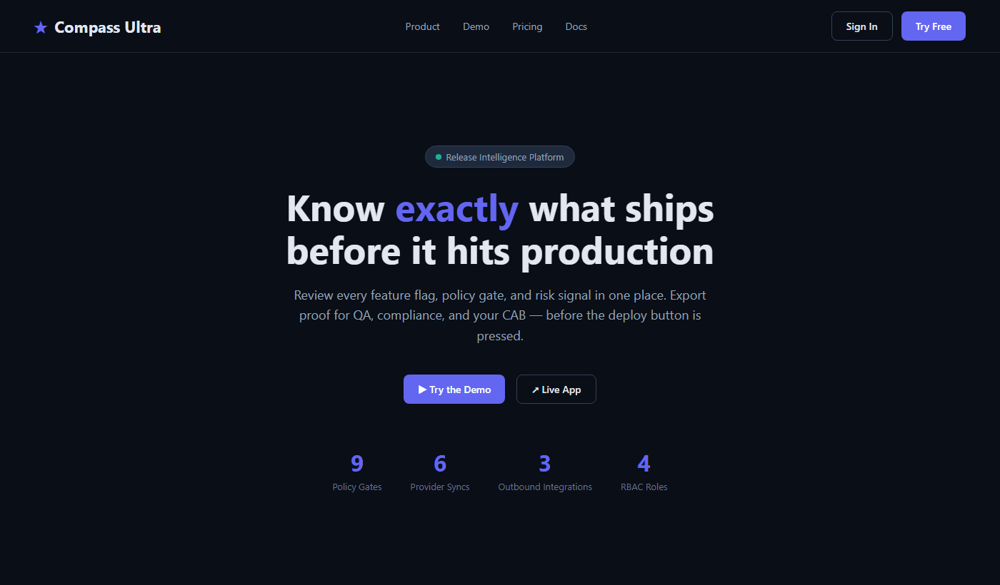

# 🧭 Compass Ultra 

> **Inteligencia de releases para equipos que despliegan detrás de feature flags.**

<p align="center">
  <a href="README.md"></a>
  <a href="README.es.md"></a>
  <a href="README.fr.md"></a>
  <a href="README.de.md"></a>
  <a href="README.pt-BR.md"></a>
  <a href="README.zh-CN.md"></a>
  <a href="README.ja.md"></a>
  <a href="README.ko.md"></a>
  <a href="README.it.md"></a>
  <a href="README.ar.md"></a>
</p>

Compass Ultra es una sala de control de releases para software con feature flags. Revisa el estado de los flags, las compuertas de políticas, el riesgo de despliegue, las diferencias entre snapshots, el análisis de riesgo asistido por IA y la evidencia de release lista para auditoría — antes de que los cambios en producción entren en vigor.

[🚀 Live App](https://www.compassultra.com) · [🎮 Try the Demo](https://www.compassultra.com/app?demo=true) · [🤖 AI DevOps Checker](https://www.compassultra.com/ai-devops)



---

## ✨ ¿Por qué Compass Ultra?

Los feature flags deberían hacer los releases más seguros.

Pero con el tiempo, pueden convertirse en una superficie de release por sí mismos:

* 🧟 Flags obsoletos o caducados
* 🎲 Porcentajes de despliegue arriesgados
* 👤 Propietarios y aprobadores faltantes
* 🕸️ Dependencias ocultas entre flags
* 🚨 Overrides en producción
* 💬 Hilos de Slack haciendo de pista de auditoría
* 🧩 Decisiones de release dispersas en demasiadas herramientas

**Compass Ultra convierte el caos de los feature flags en un flujo de revisión de release repetible.**

En lugar de preguntar:

> "¿Podemos desplegar?"

Tu equipo puede responder:

* ✅ ¿Qué está habilitado?
* 👥 ¿A quién afecta?
* 🔄 ¿Qué cambió?
* 💥 ¿Qué puede romperse?
* 🖊️ ¿Quién lo aprobó?
* 🧯 ¿Qué hay que arreglar primero?
* 📄 ¿Qué evidencia podemos entregar a QA, DevOps, liderazgo o cumplimiento?

---

## ⚡ La versión corta

Compass Ultra ayuda a los equipos a revisar y demostrar la preparación del release antes de desplegar.

Una revisión de release típica se ve así:

1. 📦 Cargar o importar un workspace de release.
2. 👤 Evaluar flags contra un contexto de usuario real.
3. 🛡️ Ejecutar compuertas de políticas y análisis de riesgo.
4. 🔍 Comparar snapshots de release.
5. 📄 Exportar un runbook de release.
6. 🚀 Compartir la evidencia antes de que los cambios en producción entren en vigor.

---

## 🎮 Demo en vivo

La demo funciona sin cuenta:

**Demo:** [https://www.compassultra.com/app?demo=true](https://www.compassultra.com/app?demo=true)

La demo simula un release minorista de alto riesgo (víspera de Black Friday, `peak-sale-2026.11`) con:

* 🏁 10 feature flags en LaunchDarkly, Statsig y Firebase
* 🛒 Flags de alto riesgo de checkout, venta flash y envío el mismo día
* 🚧 Bloqueadores y advertencias de políticas (brechas de dependencias, violaciones de canary)
* 🔗 Comprobaciones del grafo de dependencias
* 🧾 Comparación de snapshots
* 📄 Exportación de runbook en PDF
* 🔌 Generación de payloads para GitHub, Jira y Slack
* 🧯 Flujo de rollback con kill-switch para el estado de la demo
* 💰 Estimación de impacto financiero para la ventana de despliegue de tráfico pico

---

## 🧠 Funciones principales

### 🚦 Analizador de riesgo de release

Compass Ultra revisa el workspace de release actual y devuelve una evaluación práctica del release:

* ✅ **Ship**
* 🟡 **Hold**
* 🔴 **Fix first**

Impulsado por un servicio de IA en vivo con un fallback determinista — el análisis nunca se bloquea aunque el servicio de IA no esté disponible.

Puede detectar problemas como:

* 🔥 Flags activos de alto riesgo
* 🔗 Conflictos de dependencias
* 👻 Aprobadores faltantes
* ⏰ Flags caducados o sin propietario
* 🐤 Violaciones de despliegue canary
* 🚨 Overrides en producción
* 🧾 Patrones de despliegue sensibles al cumplimiento
* 💰 Estimaciones de impacto financiero para ventanas de despliegue de tráfico pico

---

### 🎯 Motor de evaluación de flags

Evalúa cada flag contra un contexto de usuario específico.

| Campo | Descripción |
| --- | --- |
| 👤 User key | Identificador único del usuario |
| 📧 Email | Dirección de correo del usuario |
| 🏢 Tenant | Tenant de cliente o cuenta |
| 💳 Plan | Plan de precios o de derechos |
| 🛂 Role | Rol del usuario o grupo de permisos |
| 🌎 Region | Región geográfica o de infraestructura |
| 🏳️ Country | Segmentación a nivel de país |
| 📱 Device | Tipo de dispositivo o plataforma |
| 🌐 Environment | Desarrollo, staging, producción o entorno personalizado |

Cada flag muestra:

* 🎚️ Valor evaluado
* 🧠 Motivo de resolución (coincidencia de regla, bucket de rollout, valor por defecto u override)
* 🧩 Regla o condición coincidente
* 📌 Contexto relevante usado durante la evaluación

Cambia entre presets de contexto guardados — Production admin, EU customer, Mobile guest — para ver cómo se comportan los flags por segmento.

---

### 🛡️ Compuertas de políticas empresariales (9 comprobaciones)

Compass Ultra ejecuta comprobaciones automatizadas de release en cada cambio de estado del workspace.

| 🔒 Gate | Qué comprueba |
| --- | --- |
| 🎟️ Change ticket attached | El ticket CHG o Jira está presente antes de producción |
| 👥 Critical flags have approvers | Todos los flags activos de alta/crítica prioridad tienen aprobadores nombrados |
| 🧬 Every flag has traceability | Todos los flags tienen IDs de Jira/cambio |
| ⏳ No expired flags enabled | Ningún flag habilitado ha superado su caducidad |
| 🚫 Production override discipline | No hay overrides manuales activos en producción |
| 🐤 Canary rollout limit | Los flags que requieren canary permanecen dentro del 50% de rollout |
| 🔗 Dependencies enabled | Ningún flag habilitado tiene una dependencia deshabilitada |
| 🔌 Live provider adapters configured | Al menos un token de proveedor está conectado |
| 📤 Outbound DevOps hooks configured | Los endpoints de GitHub/Jira/Slack están configurados |

---

### 🤖 Widget de chat AI DevOps

Un asistente de chat con IA flotante que puede incrustarse en cualquier página con una sola etiqueta script:

```html
<script src="https://www.compassultra.com/ai-devops-widget.js"></script>
```

* 💬 Haz preguntas sobre releases en lenguaje natural
* 🔍 Lee automáticamente el estado del workspace en vivo
* 📊 El contador de sesión muestra cuántos visitantes lo han usado
* ⚡ Fallback elegante cuando el servicio de IA no está disponible
* 🧠 Mantiene el historial del chat entre mensajes en la misma sesión

Pruébalo en vivo: [https://www.compassultra.com/ai-devops](https://www.compassultra.com/ai-devops)

---

### 🔌 Integraciones de proveedores (sincronización de solo lectura)

Importa el estado de flags en vivo desde tu proveedor de flags mediante un token de solo lectura propiedad del cliente a través del proxy del servidor.

| 🏴 Provider | Type |
| --- | --- |
| 🚀 LaunchDarkly | Provider sync |
| 📊 Statsig | Provider sync |
| 🔓 Unleash | Provider sync |
| 🏳️ Flagsmith | Provider sync |
| 🔥 Firebase Remote Config | Provider sync |

🔒 Las claves API nunca salen del proxy del backend. El navegador solo llama a la API de Compass Ultra.

---

### 📤 Integraciones DevOps salientes

Copia de payload con un clic o POST a tus herramientas existentes:

| 🔌 Integration | Type |
| --- | --- |
| 🐙 GitHub Issues | Release evidence issue |
| 🎫 Jira Change | CHG ticket update |
| 💬 Slack War Room | Release blocks / rich message |

---

### 🔍 Diff de snapshots

Compara dos puntos de control de release y ve exactamente qué cambió.

Los diffs pueden identificar:

* ➕ Flags añadidos
* ➖ Flags eliminados
* 📈 Cambios de rollout
* 🚨 Cambios de criticidad
* 👤 Cambios de propietario o aprobador
* 🛠️ Cambios de override

---

### 📄 Runbooks y certificados de release en PDF

Exporta PDFs listos para CAB para QA, liderazgo, DevOps o revisión de auditoría.

Los runbooks incluyen:

* 🏷️ Metadatos de release y ventana de despliegue
* 🎯 Evaluaciones de flags y estados de rollout
* 🛡️ Resultados de compuertas de políticas
* 🧠 Resumen de riesgo e impacto financiero
* 🧯 Notas de rollback por flag
* ✍️ Lista de firmas de aprobadores
* 🧾 Historial de auditoría

---

### 🐙 Compuerta CI de GitHub Action

Bloquea despliegues en CI cuando el riesgo de release supera un umbral configurado:

```yaml
- uses: ./.github/actions/compass-check
  with:
    compass_api_key: ${{ secrets.COMPASS_API_KEY }}
    risk_threshold: high
```

🚦 La acción falla el workflow automáticamente si se encuentran bloqueadores — se acabó el "se nos olvidó revisar los flags antes de hacer merge".

---

### 👥 RBAC (4 roles)

| 🎭 Role | Permissions |
| --- | --- |
| 🔑 Admin | Full access — flags, release, team, integrations |
| ✅ Approver | Approve releases, view all |
| 🛠️ Operator | Edit flags and release metadata |
| 👁️ Viewer | Read only |

Todas las acciones bloqueadas se registran con actor, rol, compuerta activada y marca de tiempo exacta.

---

## 🧭 Posicionamiento del producto

Compass Ultra **no** es un proveedor de feature flags.

Es la **capa de revisión de release** alrededor de los feature flags.

Úsalo cuando necesites una respuesta clara a:

> "¿Podemos desplegar con seguridad este release con feature flags y demostrarlo?"

---

## 💸 Precios

| Plan | Precio | Asientos | Ideal para |
| --- | ---: | ---: | --- |
| 🆓 Free | $0 | Solo local | Probar el workspace y la revisión de release local |
| 🧍 Solo | $49/mo | 1 seat | Operadores en solitario que necesitan sincronización en la nube, análisis de riesgo, snapshots y exportaciones |
| 🚀 Pro | $149/mo | Up to 5 seats | Equipos pequeños que necesitan revisión de release compartida y diffs |
| 👥 Team | $299/mo | Up to 15 seats | Equipos de release que necesitan RBAC, exportación de auditoría, alertas y flujos de trabajo organizacionales |
| 🏢 Enterprise | Custom | Custom | Revisión de seguridad, onboarding, términos personalizados e integraciones |

Los planes de pago comienzan con una **prueba gratuita de 7 días**.

No se requiere tarjeta de crédito. Las pruebas bajan a Free automáticamente a menos que el cliente se suscriba.

---

## 🛠️ Stack tecnológico

| Capa | Tecnología |
| --- | --- |
| ⚛️ Frontend | React, Vite |
| 🧭 Routing | React Router |
| ✂️ Code splitting | React.lazy + Suspense |
| 🎨 UI icons | Lucide React |
| 📄 PDF export | jsPDF |
| 🔐 Auth | Auth0 |
| 💳 Payments | Stripe |
| 📈 Analytics | Vercel Analytics |
| 🔒 Security headers | X-Frame-Options, CSP, HSTS, cache control |
| 🧱 Backend | Express API in the backend repo |
| 🐘 Database | PostgreSQL through backend |
| 🤖 AI risk analysis | Backend AI service with deterministic fallback |
| ☁️ Hosting | Vercel (frontend) · Railway (backend) |

---

## 📦 Código fuente

Este repositorio público contiene la página de lanzamiento de Compass Ultra, documentación, activos de GitHub Pages y materiales del proyecto de cara al público.

La aplicación de producción y el backend se mantienen por separado. Los usuarios públicos pueden explorar la app en vivo y la demo sin necesitar acceso a repositorios de implementación privados.

---

## 🔒 Modelo de seguridad

Compass Ultra está diseñado como una capa de revisión de release.

* 🧪 La demo local funciona sin inicio de sesión.
* 🔐 Los snapshots en la nube requieren autenticación.
* 🔌 La sincronización de proveedores usa tokens de solo lectura a través del proxy del backend — las claves API nunca pasan por el navegador.
* 🛡️ Cabeceras de seguridad en todas las respuestas: `X-Frame-Options`, `Content-Security-Policy`, `Strict-Transport-Security`, `X-Content-Type-Options`.
* 💳 Stripe gestiona los datos de tarjeta.
* 🪪 Auth0 es el proveedor de identidad.
* 🔗 Los enlaces compartidos codifican el estado del workspace y no deben usarse para secretos.
* 🏢 Los clientes Enterprise deben usar revisión de seguridad y términos personalizados antes del despliegue en vivo con proveedores.

---

## 🗺️ Hoja de ruta

* 🧾 Límites de asientos aplicados completamente en el backend
* 🧪 Automatización del ciclo de vida de prueba sin tarjeta
* 🚦 Controles contra abuso de prueba por correo, dominio y uso
* 👥 Flujo de invitación de equipo
* 🏢 Workspaces organizacionales
* 🔌 Más adaptadores de proveedores
* 💬 Flujo de trabajo de la app de Slack
* 🐙 Expansión de la compuerta de release de GitHub Action
* 📤 Más formatos de exportación
* 🔒 Paquete de revisión de seguridad para Enterprise
* 📊 Conteos de sesión y mensajes del backend en vivo para el widget AI DevOps

---

## ✅ Estado

Compass Ultra está en vivo:

**Production:** [https://www.compassultra.com](https://www.compassultra.com)

**Demo:** [https://www.compassultra.com/app?demo=true](https://www.compassultra.com/app?demo=true)

**AI DevOps Checker:** [https://www.compassultra.com/ai-devops](https://www.compassultra.com/ai-devops)

---

## 🚀 Creado para

Equipos que despliegan rápido y aún necesitan evidencia antes de producción.

**Despliega con confianza. Revisa con evidencia. Demuestra cada release.** 🧭