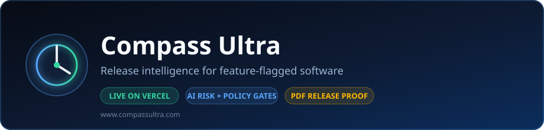

<p align="center">
  
</p>

# 🧭 Compass Ultra

> **Release intelligence for teams that ship behind feature flags.**

<p align="center">
  <a href="https://www.compassultra.com"></a>
  <a href="https://www.compassultra.com/app?demo=true"></a>
  <a href="https://www.compassultra.com/ai-devops"></a>
</p>

<p align="center">
  
  
  
  
</p>

<p align="center"></p>
<p align="center"></p>

<p align="center">
  
  
  
  
</p>

### Translations

<p align="center">
  <a href="README.md"></a>
  <a href="README.es.md"></a>
  <a href="README.fr.md"></a>
  <a href="README.de.md"></a>
  <a href="README.pt-BR.md"></a>
  <a href="README.zh-CN.md"></a>
  <a href="README.ja.md"></a>
  <a href="README.ko.md"></a>
  <a href="README.it.md"></a>
  <a href="README.ar.md"></a>
</p>

Compass Ultra is a release control room for feature-flagged software. Review flag state, policy gates, rollout risk, snapshot diffs, AI-assisted risk analysis, and audit-ready release proof — before production changes go live.

[🚀 Live App](https://www.compassultra.com) · [🎮 Try the Demo](https://www.compassultra.com/app?demo=true) · [🤖 AI DevOps Checker](https://www.compassultra.com/ai-devops) · [🔒 Trust](https://www.compassultra.com/trust)

```mermaid
%%{init: {'theme': 'dark'}}%%
flowchart LR
  A[Import flags] --> B[Evaluate context]
  B --> C[Policy gates]
  C --> D[AI risk analysis]
  D --> E[Snapshot diff]
  E --> F[PDF certificate]
  F --> G[GitHub / Jira / Slack]

  style A fill:#0d1b33,stroke:#58a6ff,color:#e6edf3
  style B fill:#0d1b33,stroke:#58a6ff,color:#e6edf3
  style C fill:#0d1b33,stroke:#ffb800,color:#e6edf3
  style D fill:#0d1b33,stroke:#bc8cff,color:#e6edf3
  style E fill:#0d1b33,stroke:#33d69f,color:#e6edf3
  style F fill:#0d1b33,stroke:#33d69f,color:#e6edf3
  style G fill:#0d1b33,stroke:#58a6ff,color:#e6edf3
```


<p align="center"></p>
<p align="center"></p>




---

<p align="center"></p>
<p align="center"></p>


Feature flags are supposed to make releases safer.

But over time, they can become a release surface of their own:

* 🧟 Stale or expired flags
* 🎲 Risky rollout percentages
* 👤 Missing owners and approvers
* 🕸️ Hidden flag dependencies
* 🚨 Production overrides
* 💬 Slack threads pretending to be audit trails
* 🧩 Release decisions scattered across too many tools

**Compass Ultra turns feature-flag chaos into a repeatable release review workflow.**

Instead of asking:

> "Are we good to ship?"

Your team can answer:

* ✅ What is enabled?
* 👥 Who is affected?
* 🔄 What changed?
* 💥 What can break?
* 🖊️ Who approved it?
* 🧯 What needs to be fixed first?
* 📄 What proof can we hand to QA, DevOps, leadership, or compliance?

---

<p align="center"></p>
<p align="center"></p>


Compass Ultra helps teams review and prove release readiness before shipping.

A typical release review looks like this:

1. 📦 Load or import a release workspace.
2. 👤 Evaluate flags against a real user context.
3. 🛡️ Run policy gates and risk analysis.
4. 🔍 Compare release snapshots.
5. 📄 Export a release runbook.
6. 🚀 Share the proof before production changes go live.

---

<p align="center"></p>
<p align="center"></p>


The demo works without an account:

**Demo:** [https://www.compassultra.com/app?demo=true](https://www.compassultra.com/app?demo=true)

The demo simulates a risky retail release (Black Friday eve, `peak-sale-2026.11`) with:

* 🏁 10 feature flags across LaunchDarkly, Statsig, and Firebase
* 🛒 High-risk checkout, flash-sale, and same-day shipping flags
* 🚧 Policy blockers and warnings (dependency gaps, canary violations)
* 🔗 Dependency graph checks
* 🧾 Snapshot comparison
* 📄 PDF runbook export
* 🔌 GitHub, Jira, and Slack payload generation
* 🧯 Kill-switch rollback flow for demo state
* 💰 Financial impact estimate for peak-traffic deploy window

---

<p align="center"></p>
<p align="center"></p>


### 🚦 Release Risk Analyzer

Compass Ultra reviews the current release workspace and returns a practical release assessment:

* ✅ **Ship**
* 🟡 **Hold**
* 🔴 **Fix first**

Powered by a live AI service with a deterministic fallback — analysis is never blocked even when the AI service is unavailable.

It can detect issues such as:

* 🔥 High-risk active flags
* 🔗 Dependency conflicts
* 👻 Missing approvers
* ⏰ Expired or ownerless flags
* 🐤 Canary rollout violations
* 🚨 Production overrides
* 🧾 Compliance-sensitive rollout patterns
* 💰 Financial impact estimates for peak-traffic deploy windows

---

### 🎯 Flag Evaluation Engine

Evaluate every flag against a specific user context.

| Field | Description |
| --- | --- |
| 👤 User key | Unique user identifier |
| 📧 Email | User email address |
| 🏢 Tenant | Customer or account tenant |
| 💳 Plan | Pricing or entitlement plan |
| 🛂 Role | User role or permission group |
| 🌎 Region | Geographic or infrastructure region |
| 🏳️ Country | Country-level targeting |
| 📱 Device | Device or platform type |
| 🌐 Environment | Development, staging, production, or custom environment |

Each flag shows:

* 🎚️ Evaluated value
* 🧠 Resolution reason (rule match, rollout bucket, default, or override)
* 🧩 Matching rule or condition
* 📌 Relevant context used during evaluation

Switch between saved context presets — Production admin, EU customer, Mobile guest — to see how flags behave per segment.

---

### 🛡️ Enterprise Policy Gates (9 Checks)

Compass Ultra runs automated release checks on every workspace state change.

| 🔒 Gate | What it checks |
| --- | --- |
| 🎟️ Change ticket attached | CHG or Jira ticket is present before production |
| 👥 Critical flags have approvers | All high/critical active flags have named approvers |
| 🧬 Every flag has traceability | All flags have Jira/change IDs |
| ⏳ No expired flags enabled | No enabled flags are past expiration |
| 🚫 Production override discipline | No manual overrides active in production |
| 🐤 Canary rollout limit | Canary-required flags stay within 50% rollout |
| 🔗 Dependencies enabled | No enabled flag has a disabled dependency |
| 🔌 Live provider adapters configured | At least one provider token is connected |
| 📤 Outbound DevOps hooks configured | GitHub/Jira/Slack endpoints are set |

---

### 🤖 AI DevOps Chat Widget

A floating AI chat assistant that can be embedded on any page with a single script tag:

```html
<script src="https://www.compassultra.com/ai-devops-widget.js"></script>
```

* 💬 Ask release questions in natural language
* 🔍 Reads the live workspace state automatically
* 📊 Session counter shows how many visitors have used it
* ⚡ Graceful fallback when AI service is unavailable
* 🧠 Maintains chat history across messages in the same session

Try it live: [https://www.compassultra.com/ai-devops](https://www.compassultra.com/ai-devops)

---

### 🔌 Provider Integrations (Read-Only Sync)

Import live flag state from your flag provider via a customer-owned read-only token through the server proxy.

| 🏴 Provider | Type |
| --- | --- |
| 🚀 LaunchDarkly | Provider sync |
| 📊 Statsig | Provider sync |
| 🔓 Unleash | Provider sync |
| 🏳️ Flagsmith | Provider sync |
| 🔥 Firebase Remote Config | Provider sync |

🔒 API keys never leave the backend proxy. The browser only calls the Compass Ultra API.

---

### 📤 Outbound DevOps Integrations

One-click payload copy or POST to your existing tools:

| 🔌 Integration | Type |
| --- | --- |
| 🐙 GitHub Issues | Release evidence issue |
| 🎫 Jira Change | CHG ticket update |
| 💬 Slack War Room | Release blocks / rich message |

---

### 🔍 Snapshot Diff

Compare two release checkpoints and see exactly what changed.

Diffs can identify:

* ➕ Added flags
* ➖ Removed flags
* 📈 Rollout changes
* 🚨 Criticality changes
* 👤 Owner or approver changes
* 🛠️ Override changes

---

### 📄 PDF Release Runbooks & Certificates

Export CAB-ready PDFs for QA, leadership, DevOps, or audit review.

Runbooks include:

* 🏷️ Release metadata and deploy window
* 🎯 Flag evaluations and rollout states
* 🛡️ Policy gate results
* 🧠 Risk summary and financial impact
* 🧯 Rollback notes per flag
* ✍️ Approver sign-off list
* 🧾 Audit history

---

### 🐙 GitHub Action CI Gate

Block deploys in CI when release risk exceeds a configured threshold:

```yaml
- uses: ./.github/actions/compass-check
  with:
    compass_api_key: ${{ secrets.COMPASS_API_KEY }}
    risk_threshold: high
```

🚦 The action fails the workflow automatically if blockers are found — no more "we forgot to check the flags before merging."

---

### 👥 RBAC (4 Roles)

| 🎭 Role | Permissions |
| --- | --- |
| 🔑 Admin | Full access — flags, release, team, integrations |
| ✅ Approver | Approve releases, view all |
| 🛠️ Operator | Edit flags and release metadata |
| 👁️ Viewer | Read only |

All blocked actions are logged with actor, role, gate triggered, and exact timestamp.

---

<p align="center"></p>
<p align="center"></p>


Compass Ultra is **not** a feature flag provider.

It is the **release review layer** around feature flags.

Use it when you need a clear answer to:

> "Can we safely ship this feature-flagged release, and can we prove it?"

---

<p align="center"></p>
<p align="center"></p>


| Plan | Price | Seats | Best for |
| --- | ---: | ---: | --- |
| 🆓 Free | $0 | Local only | Trying the workspace and local release review |
| 🧍 Solo | $49/mo | 1 seat | Solo operators who need cloud sync, risk analysis, snapshots, and exports |
| 🚀 Pro | $149/mo | Up to 5 seats | Small teams that need shared release review and diffing |
| 👥 Team | $299/mo | Up to 15 seats | Release teams that need RBAC, audit export, alerts, and org workflows |
| 🏢 Enterprise | Custom | Custom | Security review, onboarding, custom terms, and integrations |

Paid plans start with a **7-day free trial**.

No credit card required. Trials downgrade to Free automatically unless the customer subscribes.

---

<p align="center"></p>
<p align="center"></p>


| Layer | Technology |
| --- | --- |
| ⚛️ Frontend | React, Vite |
| 🧭 Routing | React Router |
| ✂️ Code splitting | React.lazy + Suspense |
| 🎨 UI icons | Lucide React |
| 📄 PDF export | jsPDF |
| 🔐 Auth | Auth0 |
| 💳 Payments | Stripe |
| 📈 Analytics | Vercel Analytics |
| 🔒 Security headers | X-Frame-Options, CSP, HSTS, cache control |
| 🧱 Backend | Express API in the backend repo |
| 🐘 Database | PostgreSQL through backend |
| 🤖 AI risk analysis | Backend AI service with deterministic fallback |
| ☁️ Hosting | Vercel (frontend) · Railway (backend) |

---

<p align="center"></p>
<p align="center"></p>


| Repo | What it is |
| --- | --- |
| **[Compass-Ultra](https://github.com/DaCameraGirl/Compass-Ultra)** (this repo) | Public showcase — README, docs, GitHub Pages landing, demo GIF |
| **[Compass-Ultra-Pro](https://github.com/DaCameraGirl/Compass-Ultra-Pro)** | Production React/Vite app deployed to [www.compassultra.com](https://www.compassultra.com) |
| **[compass-ultra-backend](https://github.com/DaCameraGirl/compass-ultra-backend)** | API, AI risk analysis, billing, cloud snapshots |
| **[compass-ultra-web-intel](https://github.com/DaCameraGirl/compass-ultra-web-intel)** | Snowflake / dbt Web Intel pipeline proof |

This public repository is the **marketing and docs surface**. The live product runs on Vercel and Railway — explore the demo without needing private repo access.

---

<p align="center"></p>
<p align="center"></p>


Compass Ultra is designed as a release review layer.

* 🧪 Local demo works without login.
* 🔐 Cloud snapshots require authentication.
* 🔌 Provider sync uses read-only tokens through the backend proxy — API keys never pass through the browser.
* 🛡️ Security headers on all responses: `X-Frame-Options`, `Content-Security-Policy`, `Strict-Transport-Security`, `X-Content-Type-Options`.
* 💳 Stripe handles card data.
* 🪪 Auth0 is the identity provider.
* 🔗 Share links encode workspace state and should not be used for secrets.
* 🏢 Enterprise customers should use security review and custom terms before live provider rollout.

---

<p align="center"></p>
<p align="center"></p>


* 🧾 Full backend-enforced seat limits
* 🧪 No-card trial lifecycle automation
* 🚦 Trial abuse controls by email, domain, and usage
* 👥 Team invite flow
* 🏢 Organization workspaces
* 🔌 More provider adapters
* 💬 Slack app workflow
* 🐙 GitHub Action release gate expansion
* 📤 More export formats
* 🔒 Security review package for Enterprise
* 📊 Live backend session and message counts for AI DevOps widget

---

<p align="center"></p>
<p align="center"></p>


<p align="center">
  <a href="https://www.compassultra.com"></a>
  <a href="https://www.compassultra.com/app?demo=true"></a>
  <a href="https://www.compassultra.com/ai-devops"></a>
</p>

---

<p align="center"></p>
<p align="center"></p>


Teams that ship fast and still need proof before production.

**Ship with confidence. Review with evidence. Prove every release.** 🧭
